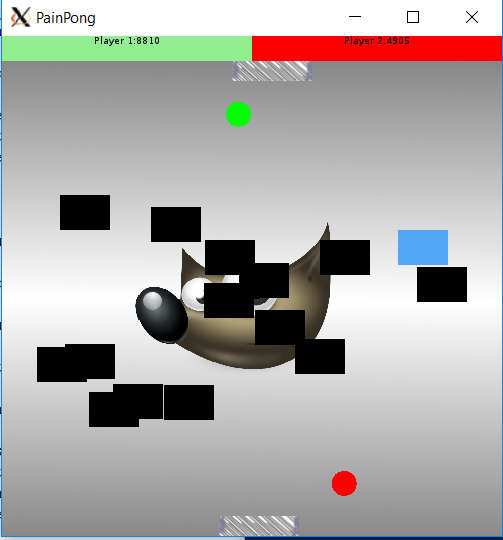

# PainPong

PainPong est un jeu vidéo pour deux joueurs. Il rapproche un peu plus le simple casse brique de Pong, son inspiration originelle.

Chaque joueur possède une balle de couleur et une raquette.
Le but est de détruire le plus de briques avec sa balle en la faisant rebondir sur la raquette pour gagner le plus de points possible.
Tout en renvoyant la balle de l'adversaire en touchant le moins de briques possible.

Si un joueur ne ratrappe pas une balle à temps, il perdra des points et la balle réaparaitra à l'écran.

Le jeu se termine quand il n'y a plus de briques à l'ecran.



# Compilation

Le jeu a été testé sur Windows et Linux, il devrait néanmoins fonctionner sans problème sur mac OS et BSD.

il est écrit en c++ et dépend de Qt4+. Les compilateurs utilisés lors du développement sont GNU g++ 6.3 et 5.3.

## Linux

```bash
# instalation des dépendences de compilation (exemple pour Debian)
apt install build-essential qt5-default qt5-qmake
# génération du Makefile
qmake
# compilation du projet
make # ou 'make debug' pour un build de debug etc..

# execution
./PainPong
```

## Windows
Le plus simple est d'utiliser l'IDE [Qt creator](https://www.qt.io/download) et importer le fichier ```PainPong.pro``` 
Il suffira alors de cliquer sur le bouton Play vert pour compiler et executer le jeu. 

# Documentation

La documentation du projet est écrite pour [Doxygen](http://www.doxygen.nl/) pour la générer il suffit de d'installer l'outil et 
executer la commande ```doxygen Doxyfile```
La documentation ce trouvera alors dans le dossier html.

> sous linux la comande make doc permet de générer la documentation.
